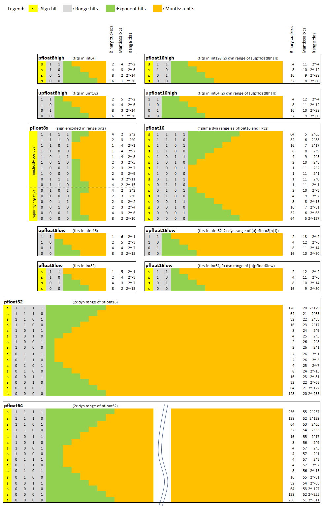

# pfloat: A 8-/16-/32-bit floating point number family

Key words: floating point number, varaible precision, CNN simulation, reduced bit size, FP8, FP16, FP32, bfloat, neural network

## Introduction
Floating point representation of 'real world' numbers are required for simulations of 'real world' systems. The number of available bits as well as the meaning of those bits has a profound impact on the accuracy of such simulations. 

There's a range of floating point number representations available, notably the ones standardized by IEEE plus some important additional formats, worth mentioning here is
bfloat16.

The IEEE formats (e.g. float, double) use the MSB as sign bit, the next 8 or 11 bits as biased exponent, with the reminder of the (LSB-)bits as mantissa bits. 
Each exponent bit pattern covers a binary bucket, with the mantissa bits determining the actual number inside this binary bucket.
The number of exponent and mantissa bits is kept constant, which implies that the exponent bias is a constant. 
Those number ranges cover ranges from +max to minus max, where max is typically a large number.

The number of exponent bits determine the dynamic range of representable numbers, while 
the number of mantissa bits determine the accuracy. 

We are addressing here 
general and specific cases where the number of exponent and mantissa bits 
is not equal for all representable floating point numbers. We implement a selected
set of 8-/16-/32-bit floating point types which are judged to be good candidates for simulations of CNNs (Convolutional Neural Networks).

## The generalized case: vfloat

We consider a family of floating point representations, which we name **vfloat** for the current discussion, 
which are basically characterized by not having a constant (but **v**ariable) exponent bias as well as a **v**ariable number of exponent- and mantissa-bits.  

In other words: Precious bits are invested to divide the entire range of representable numbers into several (sub-)ranges. 
Each (sub-)range can have its own exponent bias, the magnitude of which is implicitly defined by the specific vfloat type.
The exponent bias for vfloat is encoded in range bits. In addition, each encoded range of a vfloat can have its own distinct number of sign-/exponent-/mantissa-bits.

For example, the vfloat type
`vfloat8_32_2_5_0_1` would be an 8-bit 
floating point number with one sign bit, 4 ranges (encoded in 2 bits), with 2,5,0,1 
exponent bits in the respective ranges '00', '01, '10, '11', 
and with the smallest exponent bucket starting at magnitude 2^-32. 
A prefix 'u' would mean that the sign bit is omitted, resulting an unsigned floating point 
number (and one more mantissa bit for a given implementation word size).

In the above example, 3 bits are used by 1 sign- and 2 range-bits, leaving 5 bits for 
exponent and mantissa, with the following exponent/mantissa-distribution for the 
`vfloat8_32_2_5_0_1` 
 type :

|Range bits | Exponent bits | --> Number of binary buckets |Mantissa bits | Range bias |
| :---: | :---: | :---: | :---: |    :-----: | 
| 0 = 0b00 | **2** | 4 | 3  | 2^-**32** |
| 1 = 0b01 | **5** | 32 | 0  | 2^-28 |
| 2 = 0b10 | **0** | 1 | 5 | 2^4 |
| 3 = 0b11 | **1** | 2 | 4 | 2^5 |

As a special case, (plus-/minus-) zero is defined as exponent and mantissa bits all zero in range 0, 
resulting the smallest non-zero magnitude of representable numbers in the above example being 2^-32.
The largest representable number magnitude is equal to:
range_bias times 2^range11_exponent_bits times sum of one and fractional contribution from all-ones mantissa bits =  
2^5*2^1*(1+(2^4 - 1)*2^-4) = 124.0

With 1 sign bit, and 2 range bits, there are 6 different combinations of exponent and mantissa bits available, which 
can be assigned to one of the 4 (signed) ranges - which allows for the definition of 2'592 different vfloat8 
types for each specified smallest exponent bucket.

While it's deemed prohibitive to implement all possible vfloat types, it quickly becomes obvious 
that the fundamental vfloat principle allows to design a floating point representation 
such that the resolution ('accuracy') is optimized for ranges 'where it counts', at the 
cost of lower resolution ('less accuracy') where it does not hurt (much).

We note (for completeness only) that one can design vfloat types with
non-consecutive number coverage. For example there could be one range
dedicated to numbers close to zero, e.g [0.0, 2^-64..2^-60), with numbers in 
[2^-60..2^-16) not being representable, and a second range covering [2^-4 .. 1.0). 
For such cases, we'd recommend considering ranges with all 
bits being assigned to exponent (see effect of such an approach in 
range 0b01 above, which is covering 32 binary buckets).

Of particular interest
(for us) are vfloat type designs with good accuracy close to (+-) 1.0 (Volt), while 
having dynamic ranges of either ~2^-30 (~1nVolt) or 2^-15 (~30uVolt), with the 
possibility to handle double those dynamic ranges (~2^-60) when multyplying two vfloat 
numbers. We also see potential use for unsigned vfloat types.

## The specific case: pfloat

### Design principles

To limit the number of vfloat types that need to be implemented, a couple of self-induced limitations are introduced:
1) The range of representable numbers is limited to either magnitudes of 0.0 and 1.0 (_both_ inclusive), or such as to be compatible with IEEE754-2008 (aka float);
2) The number of ranges is either 4 or 16 (2 or 4 range bits);
3) The number of exponent bits between two adjacent ranges can differ by a maximum of 1 bit, and is either progressively increasing or decreasing from ranges with smallest number of exponent bits;
4) The number of mantissa bits is maximized for numbers close to magnitude 1.0, at the cost of reduced number of mantissa bits for very small (or very large) numbers;
5) The respective dynamic ranges are chosen to be 'potentially relevant' for CNN simulations;
6) For pfloat types covering [0.0..1.0] and [-1.0..1.0], bit patterns of range-bits all zero, exponent-bits all zero, mantissa-bits all zero represents 0.0, and bit patterns of range-bits all zero, exponent-bits all zero, mantissa-bits 0b0...01 represents 1.0;
7) For pfloat types covering [0.0..1.0] and [-1.0..1.0], there is obviously no 'inf', and we abstain from defining a 'nan' (disclaimer: we're considering to use -0.0 to represent 'nan' in the future)

The progressive increase/decrease of exponent bits over ranges leads to the 'p' in the **p**float naming convention.

A very important side effect of the above: The limitation to number ranges of magnitude [0.0..1.0] has the effect that the result of a multiplication of two numbers is 
guaranteed to fall in this number range. With appropriate scaling, even the final result of multiply-add operations on 
vectors will fall in this number range. This greatly simplifies handling of overflow, simply by avoiding it.

Disclaimer: The above limitations might or might not be what you're looking for. In this case, please keep looking (elsewhere)...

### Implemented pfloat number formats

A total of ten number formats are addressed here. The nomenclature used is straight forward:
- A prefix 'u' means unsigned type; absence of this prefix implicitly means signed type
- The number indicates how many bits are used in the type implementation (8 --> 8 bits, 16 --> 16 bits, 32 --> 23-bits)
- The postfix [high |low] gives a hint about the size of the dynamic range
- Absence of a postfix for 16- and 32-bit types indicate that the dynamic range is same as for _float_


| #bits | Signed | #ranges | Type name| #mantissa bits| range | dynamic range|
| :---: |:---: |:---: |:---: |:---: |:---: |:---: | 
|8|yes|4|pfloat8high| 1 - 4| [-1.0 .. 1.0] |2^-29 = 1.86E-9 = -174dB|
|8|yes|4|pfloat8low| 2 - 5| [-1.0 .. 1.0] | 2^-15+2^-16 = 4.58e-5 = -87dB|
|8|no|4|upfloat8high| 2 - 5|[0.0 .. 1.0] | 2^-29 = 1.86E-9 = -174dB|
|8|no|4|upfloat8low| 3 - 6 | [0.0 .. 1.0] |2^-15+2^-16 = 4.58e-5 = -87dB|
|16|yes|16|pfloat16high| 8 - 11| [-1.0 .. 1.0] | 2^-60+2^-67 = 8.74e-19 = -361dB
|16|yes|16|pfloat16low| 9 - 12| [-1.0 .. 1.0] | 2^-30 + 10^-38 = 9.3e-10 = -181dB
|16|no|16|upfloat16high| 9 - 12| [0.0 .. 1.0] |2^-29 = 1.86E-9 = -174dB|
|16|no|16|upfloat16low| 10 - 13| [0.0 .. 1.0] |2^-29 = 1.86E-9 = -174dB|
|16|yes|16|pfloat16| 5 - 11| ~ -2^-127 .. 2^127 | ~1e-39 = -780dB |
|32|yes|16|pfloat32| 21 - 27| ~ -2^-127 .. 2^127 |~1e-39 = -780dB |

Table1: Summary of implemented floating point types

The above number formats are best visualized by showing the exponent-mantissa distributions as well as the bias values for each pfloat type as a function of the related ranges:

Figure 1: pfloat formats overview

As one can easily appreciate from the figure above, the resolution (= number of mantissa bits) is optimized for numbers close to 1.0. 
For example, a pfloat16 number in range [0.5..8.0) has 11 mantissa bits, a upfloat16l(ow) has even 13 mantissa bits in range [0.25..1.0].
This compares favorably to a BFLOAT16, which only has 7 mantissa bits in those ranges. 
This comes at a cost, for example for pfloat16 numbers 
smaller 2^-31 (~ 0.5nV) where only 5-6 mantissa bits are available. 
Conversion float from/to BFLOAT16 
(implemented with underlying type uint16_t) is available.

Note: The range bit patterns are chosen such that small 
magnitudes have small range encoding values. 
This guarantees that the bit representation 
monotonically increases for increasing floating point magnitudes.

### pfloat math

We abstained for the initial version from implementing all possible math operations using bit-wise ALU implementations for the various pfloat types. 
Instead, we convert the pfloat inputs to 32-bit floating point, 
execute the math operation, apply a truncating to the 
mantissa bits (as to mimic a reduced size ALU), and convert back 
to pfloat, thereby applying a selectable rounding 
mechanism. The number of used mantissa bits is programmable, either via default value, or in each math 
operation (except when using operators, which always use th given default value).

We implemented the basic math operations (+, -, *, /) and boolean logic functions (==, !=, >=, <=, <, >)
via operators. We implemented all relevant type 
conversions (with double and pfloat32 only partially covered initially). We also implemented single and dual argument arbitrary math functions (all that are 
supported by the `cmath` library). Last not least, we also implemented various vector operations, 
in particular multiply add and similar.

We applied template prgramming to enable straight forward use of different pfloat types. 
For example, it is easily possible to use multyply-add with one vector (weights?) 
be represented in upfloa8l, the other vector (inputs?) represented as pfloat8h, with 
the result returned a pfloat16h. This can deliver up to 10bits of resolution in the result. 

It's worth noting that a CPU cache line size of 64 bytes - as is in widespready use - 
can hold 64 pfloat8 elements, or one pfloat8 8x8 matrix. 

Not all possible type combinations are implemented for vector math. But adding a 
specific type combination is super easy thanks to macro enhanced 
templates. Enabling a multiply-add of a first vector consisting of 
element type `upfloat8lhigh` (e.g. cell output) values with a second
vector consisting of element type `pfloat8low` (e.g. synaptic weights) 
values, each input vector having 64 elements (and hence consuming 64 Bytes
of memory each), and generating an output
of type `pfloat16high` can be achieved by adding the following line
to `pfloat_vector_math.tpp`:

```
pfloat_vectors_createMultiplyAdd(pfloat16high, upfloat8high, pfloat8low, 64);
```
The above is then used as follows (note the explicit 
scaling factor, rounding method and mantissa truncation to 12 bits): 
```
auto multiplyAddResult_pfloat = 
     pfloatMultiplyAdd<pfloat16high, upfloat8high_64_t, pfloat8low_64_t>
                (vector1, vector2,
                 scalingFactor,
                 pfloat_n::nearest,
                 0xFFFFF800,
                 0xFFFFFF80);
```

Implementation of matrix math is prepared but not done yet.

## Build, install, use

### Build and install

After the usual gitclone operation, create a build directory in the directory 
where you have cloned it and enter it, call `cmake..`, `make`, `make install`. 

```
    cd $yourDirectory
    git clone https://...
    cd pfloat
    mkdir build
    cd build
    cmake ..
    make -j8
    make install
```

This will build a static and shared library, as well as as an 
executable runtests. The libraries are installed in $yourDirectory/pfloat/lib, 
the executable in $yourDirectory/pfloat/bin. Note that if you want the libs in /usr/local/lib, 
you can either change the CMakeLists.txt, or copy the libs manually.

Designed and tested in C++11 with gcc on Ubuntu 18.04. Using a few gcc built-in functions, 
hence there would be some minimal work to port it to Windows. 
One `#pragma GCC diagnostic ignored "-Wignored-attributes"` is used to suppress a noisy warning.

### Use

The `tests/runtests.cpp` file can be used to look at various examples.

Essentially, the pfloat types can be used like they all 
were float. Hence, code below is perfectly valid 
(assuming `pfloat.h` was included and a `using namespace pfloat_n;` statement is used):
```
    pfloat16 result;
    pfloat8high operand1 = 0.25;
    pfloat8low operand2 = 0.0625;
    upfloat8low operand3 = 0.01;

    fprintf(stdout, "operand1 = 0x%x = %.6f\n", operand1.get(), pfloat2ieee<pfloat8high, float>(operand1));
    fprintf(stdout, "operand2 = 0x%x = %.6f\n", operand2.get(), pfloat2ieee<pfloat8low, float>(operand2));
    fprintf(stdout, "operand3 = 0x%x = %.6f\n\n", operand3.get(), pfloat2ieee<upfloat8low, float>(operand3));

    result = (pfloat)15.0f * (operand1 + operand2 - pfloatMathFunction<upfloat8high>((operand3 + 0.2), sqrtf));

    fprintf(stdout, "result = 0x%x = %.6f\n\n", result.get(), pfloat2ieee<pfloat16, float>(result));

    fprintf(stdout, "operand1 = 0x%x = %.6f\n", operand1.get(), pfloat8highTOfloat(operand1));
    fprintf(stdout, "operand2 = 0x%x = %.6f\n", operand2.get(), pfloat8lowTOfloat(operand2));
    fprintf(stdout, "operand3 = 0x%x = %.6f\n\n", operand3.get(), upfloat8lowTOfloat(operand3));
```
Note the `(pfloat)` type conversion which is only required if the first
argument is a float (or double), because operators of float 
can't be overloaded. A helper class `class pfloat` 
implements a wrapper for float for that purpose.

Caution: To enable all pfloat types to seamlessly 
interact amongst each other and with float/double, implicit type 
conversion is enabled by not using `explicit` in constructors. 
In most cases, this is a highly desirable feature, not a bug, BUT the user is 
nevertheless responsible to avoid any unwanted side effects - in 
particular when it comes to saturation issues (= clamping to +-1.0 in
chained math operations) or type conversions. 

Disclaimers: 
- Use as is with no guarantees whatsoever. 
- Performance is by no means optimized, as the main goal was to just have something to evaluate various pfloat type combination scenarios with respect to accuracy and dynamic range as a function of number of mantissa bits used in the underlying math and rounding methods.
- Test coverage is not (yet) 100%, hence there might still some bugs be hidden in the code.

## Next steps

- Increase test coverage
- Implement matrix math (including tensorflow-like operations)
- Play around with pfloat format combinations in math operations
- Based on insights from the above: Create vector/matix math for more of the possible type combinations
- Play around with bit sizes of underlying math
- Complete implementation of pfloat32, and for completeness add pfloat64
- Complete random rounding implementation and add multi-bit stochastic rounding
- Reluctantly (re-)assess the choices for the binary buckets per range (aka resolution vs dynamic range)
- Look a derivative applications of pfloats, in particular for (lossy) floating point and/or integer compression, e.g. 64-bit double to 16-bit pfloat
  - pfloat16_1024_512_256_128_64_32_16_8_8_8_8_16_32_64_128_256_512 might be an interesting vfloat type candidate for this
- Having fun!

PRs welcome!

